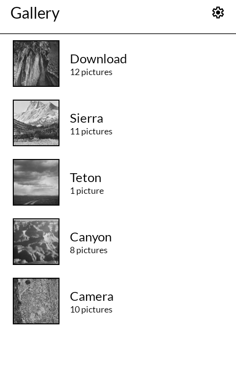
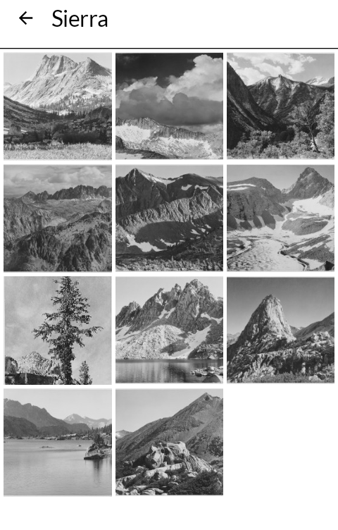
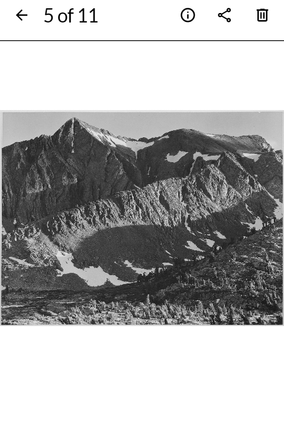
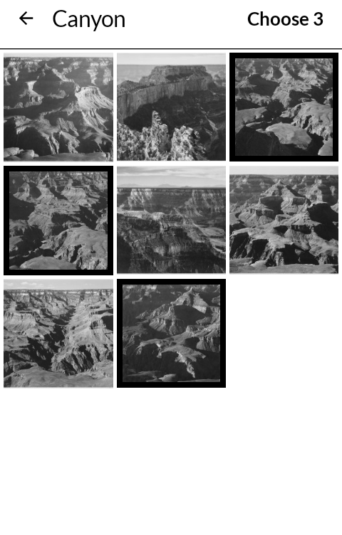

# Gallery

画廊 *garō*

The pictures on the phone, by folder, one at a time — on an E Ink phone, black on white,
with nothing moving.

Built for the [Mudita Kompakt](https://mudita.com/products/kompakt/), whose 4.3" panel has
sixteen greys, a slow redraw, and is read outdoors as often as indoors.

## Screenshots

| | | | |
|---|---|---|---|
|  |  |  |  |

## What it does

- **Folders**, newest first, each with its newest picture beside it.
- **A folder's pictures**, two, three or four across. A swipe moves a screenful and stops;
  the last row of one page is the first of the next.
- **One picture** on the whole panel. A tap at either side turns the page, as an e-reader
  does, and so does a swipe; a tap in the middle shows or hides the bar. Two fingers zoom,
  and one finger then moves about the enlarged picture.
- **Details**: when it was taken — or, when the camera recorded no date, only when it was
  saved, and it says which — its size, its folder and the camera.
- **Share** and **delete**. Deleting is asked by the phone itself, because on Android 11 and
  later a photo belongs to the app that took it.

## With the other apps

It is made to be the phone's picture app, not a room of its own.

- **Opened from Files, Email or Messaging**, a picture is shown here. One that Files or the
  camera hands over opens inside its own folder, so the pictures either side are a page-turn
  away; back returns to the app that sent it.
- **The camera's "last photo"** opens here, from any camera that sends Android's review
  request — Open Camera does.
- **Attaching a picture** in Email, or anywhere that asks Android for one, offers this. Where
  the app takes several, a tap marks a picture with a bold edge and "Choose" sends them all.
- **Show in Files** opens the picture's folder in the file manager.

## Immich

With an [Immich](https://immich.app) server set in settings — its address and an API key —
its albums appear below the phone's own folders, under their own heading, and open the same
way. Read-only: nothing on the server is changed. Pictures are fetched at the size the screen
needs and kept on the phone, so a page turned once turns again without the network.

The address has to be `https://`. A server on a Tailscale network can be given one with
`tailscale serve`. The key needs to read albums and assets and to view assets, and nothing
more. The key dialog has an eye to show what was typed, in a face where l, I and 1 differ.
When the server cannot be reached the albums last seen are still listed, and the screen
says so.

Album pictures cannot yet be shared, deleted, or chosen for another app.

## What it does not do

No videos — the panel cannot play them. No editor, no slideshow, no wallpapers, no themes.
It reads Android's own index of pictures rather than searching the storage itself, so a
folder holding a `.nomedia` file — a folder asking not to be shown — is not shown.

## Building

```
./gradlew assembleRelease
```

A release is signed by a keystore in `signing/`, which is not in this repository. Without
it the release APK builds **unsigned** and will not install anywhere — there is no
fallback key by design.

## Credit

After [Fossify Gallery](https://github.com/FossifyOrg/Gallery), GNU General Public License
v3. It was the reference for what a gallery on Android has to handle and how it orders
things: newest first throughout, names compared the way a person reads them, the camera's
review request. The app itself is written fresh — Jetpack Compose against
[MMD](https://github.com/mudita/MMD), Mudita's E Ink component library — where Fossify is
Android views, so no screen of it carried over.

Icons are [Material Symbols](https://fonts.google.com/icons), Apache License 2.0.

The pictures in the screenshots are Ansel Adams' photographs for the National Park Service,
1941–1942, from the U.S. National Archives, in the public domain.

## Licence

GNU General Public License v3.0 only. See [LICENSE](LICENSE).

Copyright © wander wildwood.
